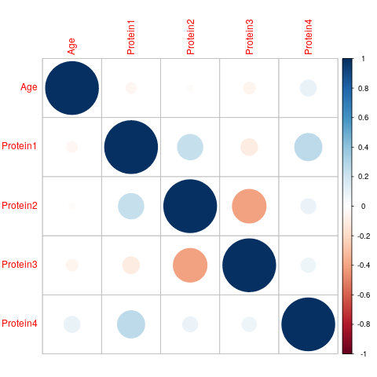
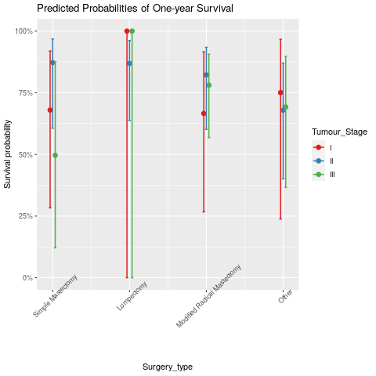

```{r setup,echo = F,include =F,message=F}
require(naniar)
require(dplyr)
require(here)

knitr::opts_chunk$set(echo = FALSE,include =FALSE,message=F)
here::i_am("INFO550_project/report/report_Rmd/report.Rmd")
knitr::opts_knit$set(root.dir = here::here('INFO550_project'))
```

**Missing data **  
Most of missings concentrated on several rows, so I just drop the incomplete rows.
```{r,vismissing,include =T }
############### missing values ################

## looking at the missing values and their location
raw_data <- read.csv(here("INFO550_project/raw_data",'BRCA.csv'),na.strings = "")
vis_miss(raw_data)
## they concentrate on several rows, so just drop the incomplete rows
data <- read.csv(here("INFO550_project/data",'data.csv'))
cat(length(raw_data$Patient_ID) - length(data$Patient_ID),
    "/",length(raw_data$Patient_ID)," incomplete data are dropped")
```
**Study population **  
Only females are included in this analysis.  
Because all ER/HER2 are positive, I only use PR+/PR- to classify the receptors  

Population characteristics  
```{r make_table1}
##### formatting for analysis ####
# make factors
## reorder the levels, put "other" to the last
## alive = 1, dead = 2
data <- data %>% mutate(Surgery_type = factor(Surgery_type,levels = c("Simple Mastectomy","Lumpectomy","Modified Radical Mastectomy","Other"))) %>%
  mutate(censor = as.numeric(factor(Patient_Status, levels = c("Alive","Dead"),labels = c(1,2)))) %>%
  mutate_at(vars(Tumour_Stage,Surgery_type,Histology),factor)

################ make table 1 #################
require(gtsummary)

table_1 <- data %>%
  select(Age,Protein1,Protein2,Protein3,Protein4,Tumour_Stage,receptor,Histology,Surgery_type,
    Patient_Status,survdays) %>%

  ## make table
  tbl_summary(label = list(Tumour_Stage ~ "Tumor Stage",
    receptor ~ "Progesterone Receptors",
    Patient_Status ~ "Patient Status",
    Surgery_type ~ "Surgery Type",
    survdays ~ "Observed Survival Days")
              ) %>%
  modify_caption("Table 1. Population Charateristics")
```
```{r table1}
table_1
```

# Result  
## Result 1: analysis of the risk factor of death  
```{r some_prereq}
## subset for survival probability
Surv1Year <- data %>%
  filter(survdays <= 365.25)
Surv3Year <- data %>%
  filter(survdays <= 365.25 * 3)
Surv5Year <- data %>%
  filter(survdays <= 365.25 * 5)

############## Add some survival analysis ############
# first, take univ analysis
## fit coxph model
require(finalfit)
OverallSurv <- "Surv(survdays,censor)"
UnivCovs <- c("Age","Protein1","Protein2","Protein3","Protein4",
  "Tumour_Stage","receptor","Surgery_type","Histology")
### fit models
univ_analysis <- data %>%
  finalfit(OverallSurv,UnivCovs) 

### protein2, protein4, tumor stage, surgery type ~ association
### protein1 ~ potential interaction
```
First, I found the potential factors by survival analysis. In the survival analysis, the effect of factors are measured by hazard ratio(HR) which is related to the survival time. Because it's a crude effect, there is no specific threshold of the p-values. Besides, this model does not aim to predict who are survivor, so I will also select the factors I'm interested in. 

Following is the crude result of survival analysis. 
In my analysis, I used reference code, so the blank values means it's the reference, and all of the results are marginal means.  For example, in the Tumour_Stage, HR = 2.63 means that the rate of dying of patients with stage III is 2.63 times those of stage I, on average.  
Univariable is the crude hazard ratio, and the multivariable is the adjusted effect(controlling for other variables). Here, I think the protein2, protein4, tumor stage and surgery type have potential association with survival experience. And there could be potential interaction among the proteins.  

```{r univ_result, include = T}
univ_analysis %>% 
  knitr::kable()
```
Let me check the correlation among proteins and age. Obviously, some of them are correlated, but now I don't care about them.  

  

Here are some grouped KM plots. In survival analysis, we always use the log-rank test. However, it cannot detect the difference when the survival functions are crossed.  
```{r kmplots,include=T}
#KM-plot
#require(survminer)
#require(survival)

# grouped by quantile
data <- data %>% 
  mutate(AgeGroup = as.numeric(Age >= quantile(Age)[2]) +
    as.numeric(Age >= quantile(Age)[3])+
    as.numeric(Age >= quantile(Age)[4]),
    Pro4Group = as.numeric(Protein4 >= 0.5) 
)
```

I find that the histology would impact the survial probability in the first year after surgery. the outcomes are a little within one year.  
```{r coxph1year, include = T}
#################### fixing #############################
###### connot install survminer in linux even locally####
###### not suitable for this R version ##################

## compare the 1 year survival of the Ductal Carcinoma and Lobular Carcinoma
#Histo1Year <- data %>% filter(survdays <=365) %>%
#  filter(Histology %in% c('Infiltrating Ductal Carcinoma','Infiltrating Lobular Carcinoma')) %>%
#  mutate(Lobular = as.numeric(Histology=='Infiltrating Lobular Carcinoma'))
#
#coxph(Surv(survdays,censor) ~ Lobular,data = Histo1Year) %>%
#  tbl_regression(exp = TRUE,label = list(Lobular ~ 'Infiltrating Lobular Carcinoma')) %>%
#  modify_caption('One year survival, Infiltrating Lobular Carcinoma vs Infiltrating Ductal Carcinoma. Crude HR') %>%
#  bold_labels()
######################################################
```

Finally, I choose this model. I believe the protein 4 is associated with the survival experience. It's adjusted by tumor stage, histology, and protein2.  
```{r finsurvmodel,include=T}
### final coxph model
multi_analysis <- data %>%
  finalfit(OverallSurv,c('Protein4','Tumour_Stage','Histology','Protein2'))
multi_analysis %>% 
  knitr::kable()
```

### Objective 2: find the treatment and the expectation
Generally, the treatment could be different because of the tumor stage. Here the surgery type and tumor stage are correlated.  
```{r surgerytype_corr,include =T}
chisq.test(data$Surgery_type,data$Tumour_Stage)
``` 


Just compare the mean effects of surgery type for different groups  

